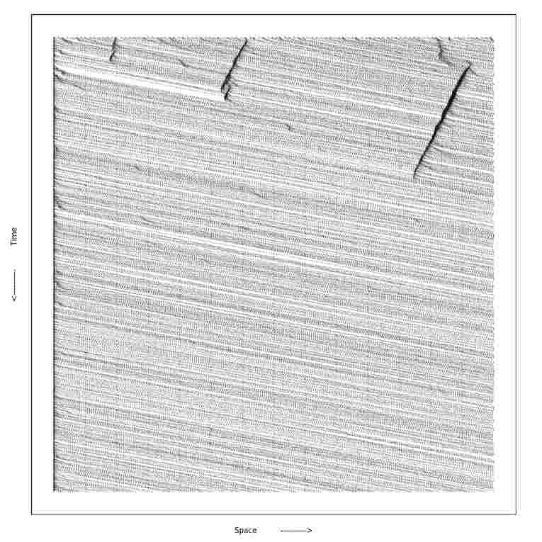

***

# Veins - Simulations of Traffic System Based on the Theory of Cellular Automaton
***
## 目录
* [项目介绍](#项目介绍)  
* [开发进度](#开发进度)
* [例子](#例子)
* [安装](#安装)
* [使用向导](#使用向导)  
* [算法原理](#算法原理)  

## 项目介绍
* 道路交通流理论模型大体可分为三大类:宏观,中观,微观.  
元胞自动机属于微观模型,是集中于单个车辆在相互作用下的个体行为描述.  
主要用于研究高速公路与交通和城市网络交通.
* 该项目旨在提供一个简易上手且功能丰富的元胞自动机交通模拟库

## 开发进度  
### 绘图功能   
 &nbsp; 时空图  
 ***
* A Ns Model Eg:

 ***  

 &nbsp;动态仿真

### 支持的模型
#### 已完成
 &nbsp; &nbsp; 标准化周期性边界条件&开口边界性条件  
 &nbsp; &nbsp; NS模型   
 &nbsp; &nbsp; Takayasu-Takayasu(TT)慢启动规则   
 &nbsp; &nbsp; BJH慢启动规则  
 &nbsp; &nbsp; VDR慢启动规则  
 &nbsp; &nbsp; 改进舒适驾驶(MCD)模型  
 &nbsp; &nbsp; 舒适驾驶(CD)模型  
 &nbsp; &nbsp; 速度效应(VE)  
#### 测试中
 &nbsp; &nbsp; KKW模型
#### 待开发
* Lee的考虑减速限制的模型
* 双车道模型
* 多车道模型
* 双向交通模型
* BCA模型
* EBCA模型
* EBCA2模型
* GBCA模型
* CCA模型  

### 运行速度优化
 &nbsp; &nbsp; Pypy支持  
 &nbsp;  &nbsp; Cpython支持  
 &nbsp;  &nbsp; Hadoop支持  

## 安装
### 依赖
* python 2.7
* matplotlib
* pandas
* numpy

### 安装
目前只能clone  
后续会推送到PyPi上  

## 使用向导

## 算法原理
### Nagel–Schreckenberg model
#### 基本思想  
>在纳格尔–元模型中道路被划分为细胞(点格阵).在原有的模型中，这些细胞是单排的两端连接,所有的细胞组成一个圆排列(周期性边界条件).每个细胞都是**空的**道路或包含一个**单一**的汽车.每辆车都分配一个速度是0和最大速度之间的整数（在Nagel–Schreckenberg model原作品中,max=5）  
以下这四个动作重复多次,是一个学习过程,可以形成任何交通堵塞。模型就是一个例子元胞自动机。该模型是一个单车道,没有超车  
算法基本工作流程:  
    ( **1** 在这里指一个细胞单位 )  
    1. 当前速度是 v   
    2. 如果前面没车，它在下一秒的速度会提高到 v + 1 ，直到达到规定的最高限速  
    3. 如果前面有车，距离为d，且 d < v.那么它在下一秒的速度会降低到 d - 1   
    4. 此外，司机还会以概率 p(定值) 随机减速， 将下一秒的速度降低到 v - 1  

* 改模型说明了即使没有任何外在原因,道路也可能发生拥堵
* 该模型是简约的,即该模型定义的任何元素的缺失会立即导致交通仿真的关键性能损失。
* 利用并行计算机模拟以该模型为基础的数百万辆汽车是可能的

> 运用实例:北莱茵-威斯特法伦州的脱机模拟交通预测系统(德国)
城市智能交通项目TRANSIMS(美国)
杜伊斯堡的内城交通
达拉斯/福斯-华斯地区的交通规划
北莱茵-魏斯特伐亚地区的交通公路网

#### 模型改进
原模型有个很大的缺陷,就是司机的减速概率是**定值随机的**  
在实际生活中,司机无缘无故的减速概率并不会很高,应该说非常**低**  
这里采用**动态减速概率**,基于司机的**视野距离内车的数目**和**当前自身车速**  
视野范围、最大速度、当前测速、两个指数参数分别为:   
计算公式为:  
*随机减速概率*:  
>   
其中*局部密度*:  
>    

为布尔量,有车占据此细胞则为1,否则为0  
两个**指数参数**的值需要使用者自己给定(可以依据公路实际数据或者化为最优化问题来解得)  
